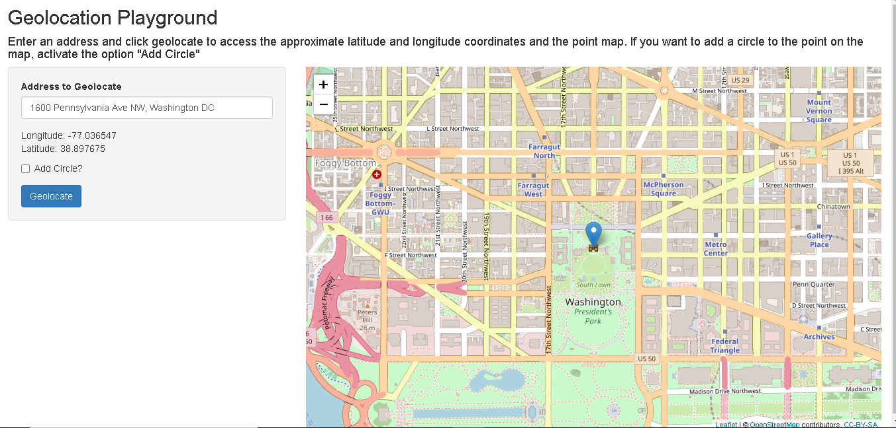

## The behind idea

Getting coordinates from a specific address is not always an easy process. There are several websites and api's that do this job, however our tool is simple and straightforward.

The application was built in shiny with two main packages in action:

1. Position Stack API, to get the geolocation data

2. Leaflet, for the production of interactive maps

---

## How to get the coordinates in our app?

it's very simple, look

1. Enter the desired address

2. Click on add Circle, if you want the point to be marked by a circle.

3. Click on geolocate... and you're done.

---

## The app appearance

```{r echo = F, message = F, out.width = "900px", fig.align='center'}
require(RJSONIO)

```

---

## The behind function to geolocate

The main function that returns the longitude and latitude of an address string is given below

```{r}
geocodeAdddress <- function(address) {
    source('./key.R') # API key
    url <- 'http://api.positionstack.com/v1/forward?access_key='
    url <- URLencode(paste(url, key, '&query=', address, "&limit=1", sep = ""))
    x <- fromJSON(url, simplify = FALSE)
    if (length(x$data)) {out <- c(x$data[[1]]$longitude, x$data[[1]]$latitude)} 
    else {out <- NA}
    out
}
```

```{r message = F}
geocodeAdddress('1600 Pennsylvania Ave NW, Washington DC') # white house
```

